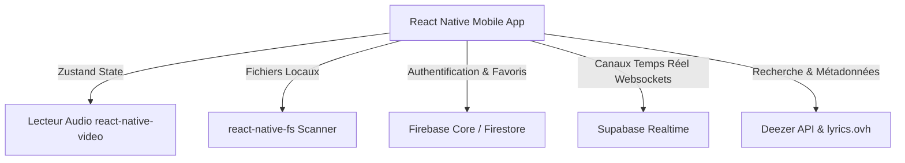

# Sauti : Application de Streaming & Synchronisation Musicale en Temps Réel

Ce document sert de guide explicatif structuré pour présenter le projet **Sauti** (un clone moderne et optimisé de Spotify) à un jury ou à un professeur. Il détaille l'architecture logicielle, les technologies clés et le rôle de chaque service d'infrastructure (**Firebase** et **Supabase**).

---

## 1. Introduction et Objectif du Projet

**Sauti** ("Voix" ou "Son" en Swahili) est une application mobile cross-platform développée en **React Native** avec **TypeScript**. 

### Problématique résolue
La plupart des applications de streaming musical imposent une séparation stricte entre la musique en ligne et les fichiers locaux de l'utilisateur, tout en proposant des fonctionnalités de partage de lecture passives (partage de liens statiques). 
**Sauti** réunit trois mondes :
1. **Le Streaming en Ligne** via l'intégration dynamique de l'API Deezer.
2. **La Lecture Locale & Hors-ligne** en scannant récursivement le stockage du téléphone.
3. **L'écoute collaborative en temps réel (Mode Party)** où les utilisateurs peuvent écouter de la musique simultanément sur des appareils distincts avec une file d'attente synchronisée.

---

## 2. Architecture Globale du Système

L'application repose sur une architecture moderne découplée :



### Stack Technique Principale
* **Framework** : React Native (CLI) avec TypeScript pour un typage statique robuste.
* **Gestion d'État (State Management)** : **Zustand** (léger, ultra-rapide, idéal pour gérer l'état global du lecteur audio et des sessions de fête sans le surpoids de Redux).
* **Moteur Audio** : `react-native-video` configuré pour charger des flux HTTP ainsi que des URI de fichiers locaux (`file://`).
* **Accès Système** : `react-native-fs` pour naviguer programmatiquement dans l'arborescence de fichiers Android.

---

## 3. Rôle de Firebase : Persistance et Profils Utilisateurs

Firebase intervient comme base de données principale de persistance utilisateur à long terme et système d'authentification.

```
                  ┌────────────────────────┐
                  │      FIREBASE SDK      │
                  └───────────┬────────────┘
                              │
             ┌────────────────┴────────────────┐
             ▼                                 ▼
   [Authentication]                  [Cloud Firestore]
 - Authentification anonyme        - Collection 'users'
   ou par email.                   - Sous-collection 'favorites' (cœur)
 - Identifiant unique (UID)        - Sous-collection 'playlists'
   utilisé pour lier les données.  - Cache hors-ligne automatique.
```

### A. Authentification (`firebase/auth`)
* Fournit un identifiant unique (UID) pour chaque utilisateur, y compris les utilisateurs invités (Anonymous Sign-In). 
* Cet identifiant sécurise et isole les données de chaque utilisateur dans la base de données.

### B. Base de Données Firestore (`firebase/firestore`)
* **Gestion des Favoris** : Quand un utilisateur clique sur l'icône de cœur, l'application appelle le service `UserContentService`. Ce dernier écrit ou supprime le document de la chanson dans `/users/{UID}/favorites/`.
* **Playlists Personnalisées** : Permet de créer des collections de morceaux en y associant des métadonnées (titre, artiste, pochette, URL).
* **Robustesse Offline** : Firestore intègre un cache local automatique. Si l'utilisateur est dans le métro ou hors-connexion, il peut toujours consulter ses favoris. Dès que le réseau revient, Firestore synchronise les modifications avec le cloud de manière transparente.

---

## 4. Rôle de Supabase : Synchronisation en Temps Réel (Websockets)

Supabase n'est pas utilisé ici comme base de données classique, mais pour son **moteur Realtime ultra-performant basé sur les Websockets (Elixir/Phoenix Channels)**. C'est le cœur du mode **"Fête" (Party Mode)**.

```
  [Téléphone Hôte]                                       [Téléphones Invités]
         │                                                        │
         │ ─── 1. Crée un salon (Code unique) ───────────────►   │
         │ ─── 2. Diffuse l'état de lecture (sync_state) ──►   │
         │      (Track, Play/Pause, Position, Queue)              │
         │                                                        │
         │ ◄── 3. Demande d'ajout de morceau (add_track) ─────   │
         │                                                        │
```

### A. Broadcast et Canaux Temporels
Pour connecter les téléphones, nous créons un canal virtuel Supabase identifié par un code de salon unique (ex: `ROOM_1234`).
* **Hôte (Host)** : Il diffuse (`broadcast`) en continu son état de lecture dès qu'il y a un changement dans son store Zustand :
  ```typescript
  supabaseService.broadcastState({
    currentTrack,
    isPlaying,
    currentTime,
    queue
  });
  ```
* **Invités (Guests)** : Ils rejoignent le même canal et écoutent les messages. Dès qu'un message de type `sync_state` arrive, l'application met à jour le lecteur local de l'invité. La musique commence à jouer au même moment et avec la même file d'attente.

### B. Gestion des requêtes collaboratives
* Un invité peut chercher un morceau en ligne (via l'API Deezer intégrée au salon) et demander à l'ajouter à la file d'attente collective.
* L'invité envoie un événement `request_add_track`. L'hôte intercepte cet événement, l'ajoute à son store global de file d'attente, ce qui rediffuse automatiquement la file d'attente mise à jour à tout le monde.

### C. Évitement des boucles infinies (Loop Prevention)
Pour éviter qu'un téléphone A mette à jour le téléphone B, qui met à jour le téléphone A, créant une boucle réseau infinie, nous avons implémenté un système de verrouillage (`isSyncingFromRemote`) :
1. Lors de la réception d'un état réseau, la variable de verrouillage passe à `true`.
2. L'application applique les modifications au lecteur audio local.
3. Le listener Zustand qui observe les changements locaux ignore l'événement car la variable est active, empêchant toute réémission.
4. Une fois le lecteur mis à jour, la variable repasse à `false`.

---

## 5. Fonctionnalités Spécifiques & Innovations Techniques

### A. Scanner de Musique Locale Récursif
Contrairement à d'autres lecteurs qui lisent des répertoires figés, Sauti utilise `react-native-fs` pour inspecter récursivement l'ensemble de l'espace de stockage externe de l'appareil (à partir de `/storage/emulated/0` ou `/sdcard`).
* **Algorithme** : Parcours en profondeur (DFS) limité à 6 niveaux de profondeur pour préserver les performances de la mémoire vive, tout en excluant intelligemment les répertoires système et de cache (comme `/Android`, `.cache`, ou `.thumbnails`).
* **Indexation par Dossier** : Les morceaux sont automatiquement regroupés par dossiers physiques (ex: `Téléchargements`, `WhatsApp Audio`, `MaMusique`), permettant de naviguer dans l'application comme dans un explorateur de fichiers.

### B. Moteur de Paroles (Lyrics)
* Intègre une requête asynchrone vers l'API publique `lyrics.ovh`.
* Les paroles sont récupérées à la volée en associant l'artiste et le titre du morceau en cours, puis affichées de manière minimaliste et immersive en plein écran.

### C. Algorithme de Recommandation de Contenu
* Implémente un modèle de recommandation de contenu hybride basé sur le profil de l'artiste écouté et l'analyse sémantique du titre.
* L'application interroge l'API Deezer pour trouver des morceaux similaires ou du même artiste et injecte dynamiquement des suggestions personnalisées en bas du lecteur.

---

## 6. Synthèse des Points Forts à Mettre en Valeur

Pour convaincre votre professeur, insistez sur les points suivants :
1. **Hybridation en ligne / hors-ligne** : L'app gère parfaitement les flux de streaming (API Deezer) et les fichiers binaires locaux du stockage physique.
2. **Combinaison intelligente Firebase / Supabase** :
   * **Firebase** excelle dans la persistance froide et structurée (historique, favoris, authentification sécurisée).
   * **Supabase** résout la problématique du temps réel chaud (Websockets ultra-rapides pour l'écoute synchronisée en direct) sans surcharger Firebase.
3. **Expérience utilisateur (UX) haut de gamme** : Swipe pour masquer le lecteur, transitions animées, mode sombre moderne et interface entièrement traduite en français.
